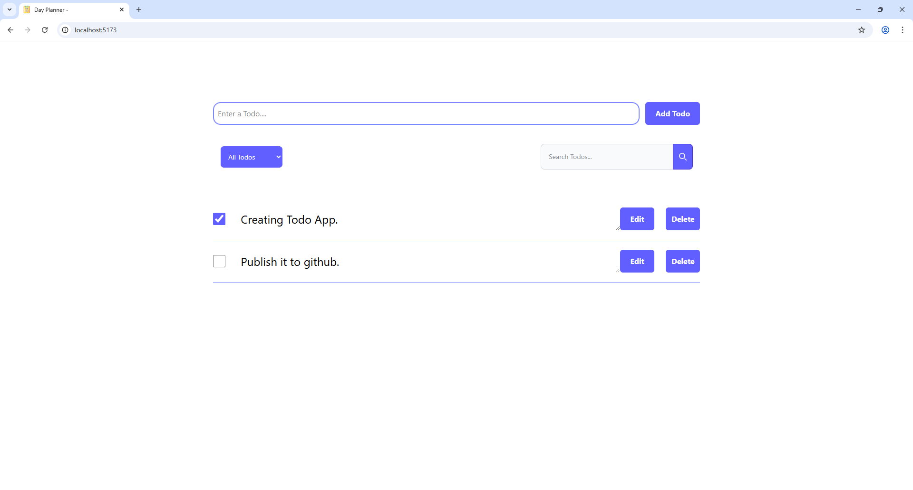
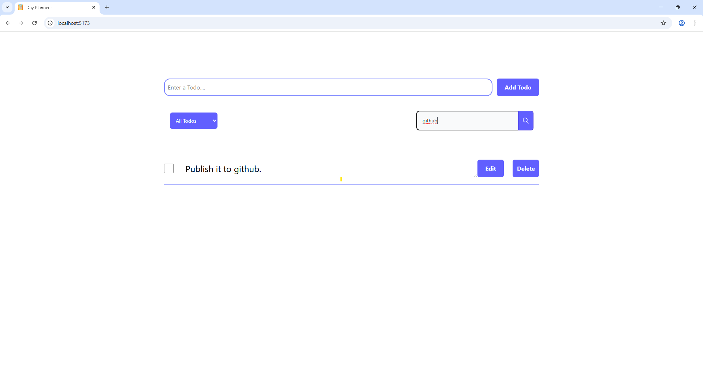
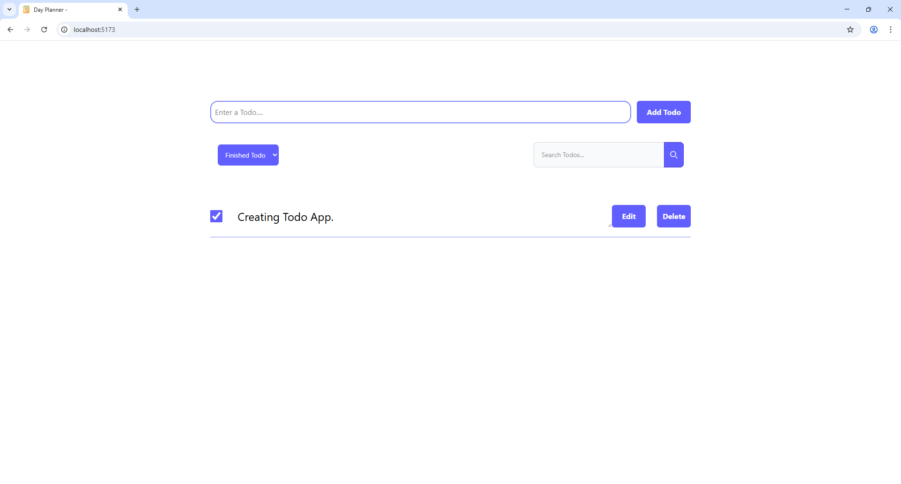

# Todo App - React.js 📝

A **simple and interactive** Todo app built with **React.js**, **HTML**, **CSS**, and **Tailwind CSS**. Stay organized by managing your daily tasks efficiently with features such as adding, editing, deleting, marking as completed, searching, and filtering tasks.

This app makes use of **React's powerful hooks**, including `useState`, `useEffect`, **Context API**, and **localStorage** to persist tasks across page reloads.

---

## 🚀 Features:

- **Add Tasks**: Easily add new tasks to your list ✏️.
- **Edit Tasks**: Quickly edit your tasks inline 📝.
- **Delete Tasks**: Remove tasks you no longer need 🗑️.
- **Mark as Completed**: Check off tasks when they're done ✅.
- **Search**: Find specific tasks with the search bar 🔍.
- **Filter Tasks**: View tasks based on their status : 
   - **All** tasks
   - **Pending** tasks
   - **Finished** tasks
- **Persistent State**: Using **localStorage** to persist tasks even after a page reload.

---

## 🛠️ Tech Stack:

- **React.js** - JavaScript library for building interactive user interfaces.
- **HTML5** - Semantic structure and markup.
- **Tailwind CSS** - Utility-first CSS framework for quick styling and responsive design.
- **JavaScript (ES6)** - Core programming for app logic and interactions.
- **React Hooks**:
  - **`useState`** - To manage task data and UI state.
  - **`useEffect`** - To handle side effects like fetching data or updating localStorage.
  - **Context API** - For global state management across components.
  - **Props** - For passing data and event handlers to child components.
---

## 📸 Preview

1. Home Page

    

2. Search Todo

    

3. Filter Todo

    

---

## 💻 Steps to Execute the App Locally:

1. **Clone the repository**:

   Open your terminal and clone the repository:

   ```bash
   git clone https://github.com/Arshad101001/Todo-App.git
    ```

2. **Navigate into the project folder**:

    Change into the project directory:

    ```bash
    cd Todo-App
    ```

3. **Install dependencies**:

    Install all the necessary dependencies listed in the `package.json` file:

    ```bash
    npm install
    ```
    

4. **Start the application**:

    Run the app locally:

    ```bash
    npm run dev
    ```

5. **Copy the URL into Browser and hit Enter**.
    
    e.g `http://localhost:5173/`


## 📸 Execution video guide

[Execution Video](./src/assets/Todo_execution.sasmp4)


